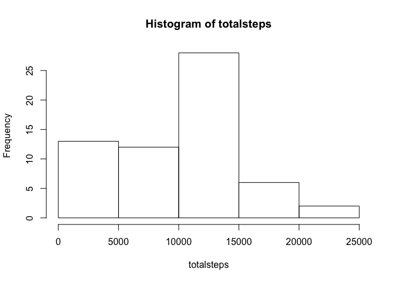
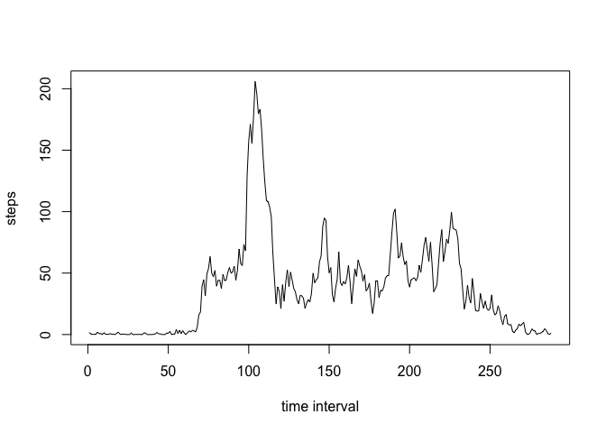
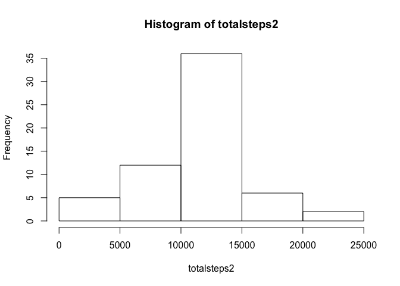
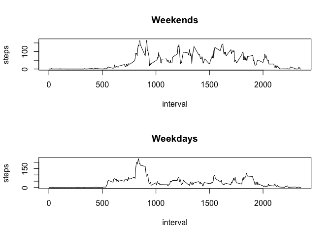

# Reproducible Research: Peer Assessment 1


## Loading and preprocessing the data

```r
activity<-read.csv("activity.csv")
activity$date <- as.Date(activity$date, format = "%Y-%m-%d")
```

## What is mean total number of steps taken per day?

```r
totalsteps<-tapply(activity$steps,activity$date,sum,na.rm=TRUE)
hist(totalsteps)
```

<!-- -->

```r
summary(totalsteps)
```

```
##    Min. 1st Qu.  Median    Mean 3rd Qu.    Max. 
##       0    6778   10400    9354   12810   21190
```

## What is the average daily activity pattern?

```r
stepsint<-tapply(activity$steps,activity$interval,mean,na.rm=TRUE)
plot(stepsint,type="l",xlab="time interval",ylab="steps")
```

<!-- -->

```r
which.max(stepsint)
```

```
## 835 
## 104
```


## Imputing missing values

```r
sum(is.na(activity))
```

```
## [1] 2304
```

```r
# replace the missing values with the mean from that 5-minute interval
activity2 <- activity
stepsint<-tapply(activity$steps,activity$interval,mean,na.rm=TRUE)
activity2$steps[is.na(activity2$steps)] <- stepsint
activity2$date <- as.Date(activity2$date, format = "%Y-%m-%d")

# make a histogram of the toal number of steps taken each day with the replaced data
totalsteps2<-tapply(activity2$steps,activity2$date,sum)
hist(totalsteps2)
```

<!-- -->

```r
summary(totalsteps2)
```

```
##    Min. 1st Qu.  Median    Mean 3rd Qu.    Max. 
##      41    9819   10770   10770   12810   21190
```

## Are there differences in activity patterns between weekdays and weekends?

```r
# create a new factor variable with two levels "weekdays" and "weekends"
activity2$week <- ifelse(weekdays(activity2$date) %in% c("Saturday", "Sunday"), "weekend", "weekday")
activity2$week <- factor(activity2$week,c("weekend","weekday"))

# make a panel plot containing a time series plot of the 5-minute interval and the average number of steps taken, averaged across all weekday days or weekend days.
par(mfrow=c(2,1))
with(activity2[activity2$week == "weekend",], plot(aggregate(steps ~ interval, FUN = mean), type = "l", main = "Weekends"))
with(activity2[activity2$week == "weekday",], plot(aggregate(steps ~ interval, FUN = mean), type = "l", main = "Weekdays"))
```

<!-- -->
